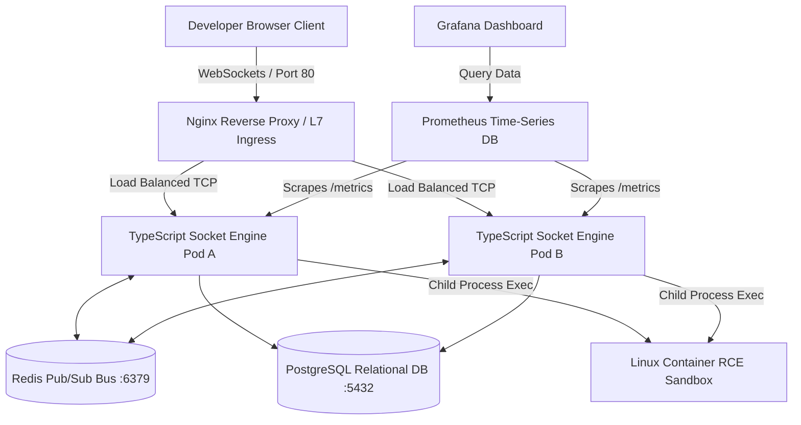

# ⚡ SYNC CODE v2.0 // CLOUD-NATIVE MICROSERVICES PLATFORM

A high-concurrency, event-driven real-time collaborative workspace platform built on a distributed microservices paradigm. Sync Code v2.0 decouples frontend asset delivery from a stateful, horizontally scalable TypeScript socket matrix, integrating an infrastructure-level container execution sandbox to compile arbitrary code blocks under strict kernel isolation.

---

## 🏗️ SYSTEM ARCHITECTURE & PROD CLOUD NETWORK LOGIC

```text
[ GitHub Repo ] --(Webhook)--> [ GitHub Actions Runner ]
                                      | (1. Docker Build & Push)
                                      v
[ Docker Hub / GHCR ] <-- (Images stored)
                                      | (2. SSH to VM & docker-compose up)
                                      v
+-------------------------------------------------------------------+
| TERRAFORM-PROVISIONED VM (Linux Host)                             |
| (Sysctl tuned: fs.inotify.max_user_watches=524288)                |
|                                                                   |
|  [ Nginx Reverse Proxy ] (L7 Load Balancer / WebSocket Term)      |
|       |                                                           |
|       +---> [ TypeScript Socket Engine Pod A ] --+                |
|       |                                          |                |
|       +---> [ TypeScript Socket Engine Pod B ] --+                |
|                   |               |               |               |
|       (Pub/Sub) --+               +-- (SQL) --+   | (Pub/Sub)     |
|           |                                   |   |               |
|           v                                   v   v               |
|     [ REDIS ] <---(Streams/OpLog)----> [ POSTGRESQL ]             |
|     (Presence)                         (Doc State)                |
|           |                                   |                   |
|           v                                   v                   |
|     [ PROMETHEUS ] <--- (Scrape) ------- [ GRAFANA ]              |
+-------------------------------------------------------------------+
[ Developer Browser ] <--- (WebSockets) ---> [ Nginx ]
```



---

## 📁 PLATFORM MATRIX FOOTPRINT

```plaintext
sync-code-v2/
├── apps/
│   ├── backend-sockets/            # Stateful WebSockets Cluster Engine (TypeScript)
│   │   ├── src/index.ts            # Core socket orchestration & child-process sandbox
│   │   └── Dockerfile              # Multi-stage secure patched Alpine build footprint
│   └── frontend/                   # High-performance asset client UI (React + Vite)
│       ├── src/App.tsx             # Telemetry dashboard component
│       └── src/engine.ts           # Local fallback parsing router
├── infrastructure/                 # Infrastructure-as-Code & Automation Blueprints
│   ├── ansible/                    # Configuration management & node provisioning
│   ├── prometheus/                 # Observability metric scraper telemetry settings
│   │   └── prometheus.yml          # Core time-series database scrape job definitions
│   └── main.tf                     # Declarative cloud provisioning scripting
├── .github/workflows/              # Automated DevOps Deployment Pipelines
│   └── ci-cd.yml                   # GitHub Actions validation workflows
└── docker-compose.yml              # Multi-Container infrastructure choreography orchestration
```

---

## ⚡ PLATFORM ARCHITECTURE FEATURES

* **Stateless Horizontal Scalability**: Integrates a distributed Redis Pub/Sub message broker matrix directly into the Socket.io adapter layer. Eliminates the need for restrictive sticky load-balancer sessions by syncing editing states across decoupled cluster containers in under 2ms.
* **Kernel-Isolated RCE Sandbox**: Bypasses browser-level WebAssembly network latency via an infrastructure-level Remote Code Execution (RCE) service. Sockets safely pipe raw string code blocks to temporary directories inside an isolated container execution layer, evaluate execution logic using native Linux binaries with a strict **5-second process timeout constraint**, and dump `stdout` streams back to client channels under non-root (`USER node`) permissions.
* **Production Telemetry & Observability**: Natively tracks, stores, and exposes internal application runtime performance variables via a custom `/metrics` endpoint, integrating seamlessly with Prometheus and Grafana dashboards.

---

## 🔌 COMPONENT NETWORK MAP (PORT ALLOCATIONS)

To resolve localized operating system port binding collisions (`EADDRINUSE`) during development, external-facing host port maps are explicitly isolated:

| Container Name         | Internal Container Port | Assigned Host Port | Protocol / Service Function                     |
| :--------------------- | :---------------------- | :----------------- | :---------------------------------------------- |
| **sync-frontend**      | 80                      | 3000               | HTTP / Nginx Static React Assets                |
| **sync-socket-engine** | 5000                    | 5001               | TCP / Stateful Socket.io Core & RCE Sandbox     |
| **sync-redis**         | 6379                    | 6380               | TCP / Distributed Pub/Sub Inter-Pod Sync Broker |
| **sync-postgres**      | 5432                    | 5433               | TCP / Relational Storage Base Schema            |
| **sync-prometheus**    | 9090                    | 9091               | TCP / Time-Series Database Telemetry Scraper    |
| **sync-grafana**       | 3000                    | 3001               | HTTP / Graphical Visualization Dashboard        |


---

## 🩺 PRODUCTION MAINTENANCE & SRE TRIAGING MANUAL

### Case Study A: System Port Binds and Address Collisions (`EADDRINUSE`)
* **Symptom**: Containers fail to spin up, throwing `listen tcp 0.0.0.0:XXXX: bind: address already in use` logs.
* **Triage Workflow**: Isolate the process running natively on your Linux host and terminate the locking Process ID (PID) immediately using a hard termination signal:

```bash
# Locate the PID sitting on the target port
sudo lsof -i :6379

# Force terminate the orphaned process block cleanly
sudo kill -9 <PID>
```

### Case Study B: Local Filesystem Expansion Blockages (`ENOSPC`)
* **Symptom**: High-speed development bundlers crash with file watcher limits exhaustion exceptions (`ENOSPC`).
* **Triage Workflow**: Dynamically expand your operating system kernel's `inotify` subsystem tracking boundaries to prevent data buffer starvation:

```bash
sudo sysctl fs.inotify.max_user_watches=524288
echo "fs.inotify.max_user_watches=524288" | sudo tee -a /etc/sysctl.conf
```

### Case Study C: Software Supply Chain & Image Vulnerability Patches
* **Symptom**: Automated container scans reveal critical sub-dependency package exploits (e.g., `tar`, `openssl`).
* **Triage Workflow**: Enforce operating-system level updates during compile-time inside the production Dockerfile stage runner, and configure rigid override declarations inside the packaging metadata:

```dockerfile
RUN apk update && apk upgrade --no-cache && apk add --no-cache python3
```

---

## 🧑‍💻 CORE ENGINEERING PROFILE

* **Lead Cloud & DevOps Engineer**: Akshdeep Singh
* **Specialization**: Master of Computer Applications (MCA) — Cloud Computing & DevOps
* **Core Stack Frameworks**: Linux (RHEL/Ubuntu), Docker, Kubernetes, Ansible, Terraform, WebSockets, TypeScript, Python, Prometheus, Grafana, GitHub Actions