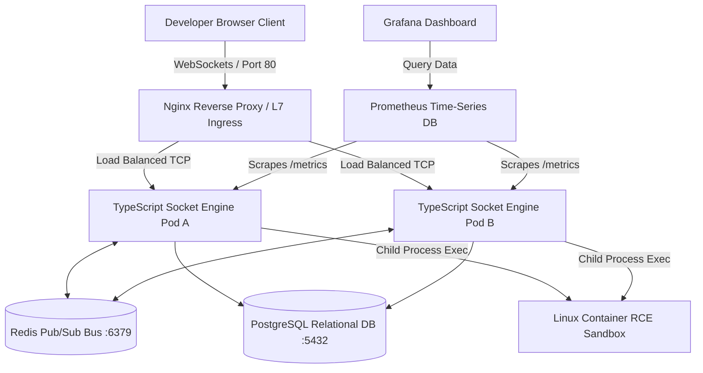

# ⚡ SYNC CODE v2.0 // CLOUD-NATIVE MICROSERVICES PLATFORM

A high-concurrency, event-driven real-time collaborative workspace platform built on a distributed microservices paradigm. Sync Code v2.0 decouples frontend asset delivery from a stateful, horizontally scalable TypeScript socket matrix, integrating an infrastructure-level container execution sandbox to compile arbitrary code blocks under strict kernel isolation.

---

## 🏗️ SYSTEM ARCHITECTURE & PROD CLOUD NETWORK LOGIC

    
```text
[ GitHub Repo ] --(Webhook)--> [ GitHub Actions Runner ]
                                      | (1. Docker Build & Validate)
                                      v
[ Docker Hub / GHCR ] <-- (Images stored)
                                      | (2. SSH to AWS EC2 & docker-compose up)
                                      v
+-------------------------------------------------------------------+
| TERRAFORM-PROVISIONED AWS EC2 (Ubuntu Linux)                      |
| (Security Group: Port 80 & 22 Open)                               |
|                                                                   |
|    [ Nginx Reverse Proxy ] (L7 Load Balancer / WebSocket Term)    |
|       ^       |                                                   |
|       |       +---> [ TypeScript Socket Engine Pod A ] --+        |
|       |       |                                          |        |
|       |       +---> [ TypeScript Socket Engine Pod B ] --+        |
|       |                   |               |               |       |
|       |       (Pub/Sub) --+               +-- (SQL) --+   |       |
|       |           |                                   |   |       |
|       |           v                                   v   v       |
|       |     [ REDIS ] <---(Streams/OpLog)----> [ POSTGRESQL ]     |
|       |     (Presence)                         (Doc State)        |
|       |           |                                   |           |
|       |           v                                   v           |
|       |     [ PROMETHEUS ] <--- (Scrape) ------- [ GRAFANA ]      |
+-------|-----------------------------------------------------------+
        |
   (WebSockets)
        |
[ Developer Browser ]
```



---

## 🔄 CI/CD WORKFLOW & FINOPS COST OPTIMIZATION

This repository utilizes a dual-stage GitHub Actions pipeline designed with strictly integrated FinOps (Financial Operations) cost-control measures:

1. **Continuous Integration (Active):** On every push, the pipeline provisions a temporary Ubuntu runner, initializes the Node.js environment, and executes a dry-run build of the Docker images. This ensures 100% structural integrity of the codebase and `Dockerfile` logic.
2. **Continuous Deployment (Paused):** The live deployment stage—which uses SSH to connect to the AWS `t2.micro` EC2 instance and execute the cluster orchestrator—is currently gated via an environment toggle (`LIVE_DEPLOYMENT_ACTIVE: 'false'`). This prevents unnecessary ongoing AWS billing overhead while preserving the complete Infrastructure-as-Code (IaC) deployment logic in the repository.

---

## 📁 PLATFORM MATRIX FOOTPRINT

```plaintext
sync-code-v2/
├── apps/
│   ├── backend-sockets/            # Stateful WebSockets Cluster Engine (TypeScript)
│   └── frontend/                   # High-performance asset client UI (React + Vite)
├── infrastructure/                 # Infrastructure-as-Code
│   ├── prometheus/                 # Observability metric scraper telemetry settings
│   └── main.tf                     # HashiCorp Terraform AWS EC2 Provisioning Script
├── nginx/                          # Layer 7 Load Balancing & Reverse Proxy
│   └── nginx.conf                  # WebSocket upgrade & upstream routing rules
├── .github/workflows/              # Automated DevOps Deployment Pipelines
│   └── ci-cd.yml                   # GitHub Actions validation workflows
├── deploy.sh                       # Automated Remote SSH Deployment Script
└── docker-compose.yml              # Multi-Container infrastructure choreography
```

---

## 🔌 COMPONENT NETWORK MAP (PORT ALLOCATIONS)

To ensure secure network isolation, all stateful databases and processing engines are shielded within the internal Docker bridge network (`sync-net`). Only the Nginx load balancer is exposed to the public internet via the AWS Security Group.

| Container Name         | Internal Port | Public Port | Service Function                                |
| :--------------------- | :------------ | :---------- | :---------------------------------------------- |
| **sync-nginx**         | 80            | **80**      | L7 Ingress / React Asset Delivery & WebSockets  |
| **sync-socket-engine** | 5000          | Hidden      | Stateful Socket.io Core & RCE Sandbox           |
| **sync-redis**         | 6379          | Hidden      | Distributed Pub/Sub Inter-Pod Sync Broker       |
| **sync-postgres**      | 5432          | Hidden      | Relational Storage Base Schema                  |
| **sync-prometheus**    | 9090          | Hidden      | Time-Series Database Telemetry Scraper          |
| **sync-grafana**       | 3000          | Hidden      | Graphical Visualization Dashboard               |

---

## 🩺 PRODUCTION MAINTENANCE & SRE TRIAGING MANUAL

### Case Study A: System Port Binds and Address Collisions (`EADDRINUSE`)
* **Symptom**: Containers fail to spin up, throwing `listen tcp 0.0.0.0:XXXX: bind: address already in use` logs.
* **Triage Workflow**: Isolate the process running natively on your Linux host and terminate the locking Process ID (PID) immediately using a hard termination signal:

```bash
# Locate the PID sitting on the target port
sudo lsof -i :6379

# Force terminate the orphaned process block cleanly
sudo kill -9 <PID>
```

### Case Study B: Local Filesystem Expansion Blockages (`ENOSPC`)
* **Symptom**: High-speed development bundlers crash with file watcher limits exhaustion exceptions (`ENOSPC`).
* **Triage Workflow**: Dynamically expand your operating system kernel's `inotify` subsystem tracking boundaries to prevent data buffer starvation:

```bash
sudo sysctl fs.inotify.max_user_watches=524288
echo "fs.inotify.max_user_watches=524288" | sudo tee -a /etc/sysctl.conf
```

---

## 🧑‍💻 CORE ENGINEERING PROFILE

* **Lead Cloud & DevOps Engineer**: Akshdeep Singh
* **Specialization**: Master of Computer Applications (MCA), Chandigarh University — Cloud Computing & DevOps
* **Core Stack Frameworks**: AWS (EC2, Security Groups), Docker, Kubernetes, Terraform, Nginx, WebSockets, TypeScript, Python, Prometheus, Grafana, GitHub Actions
